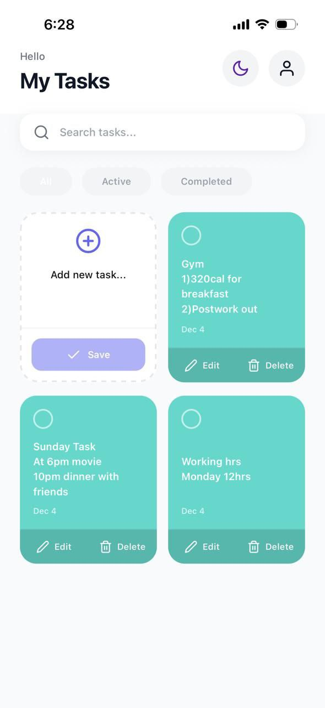
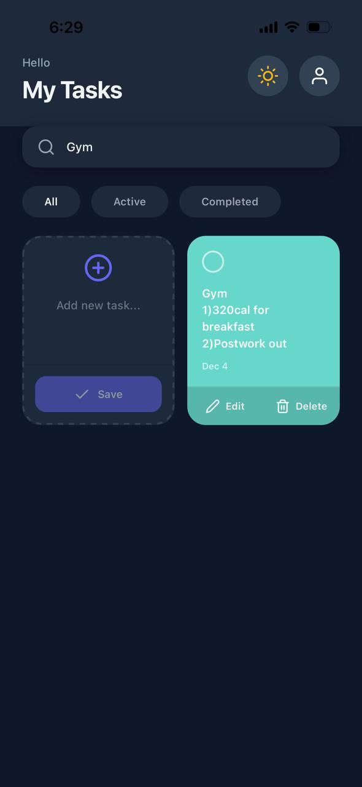
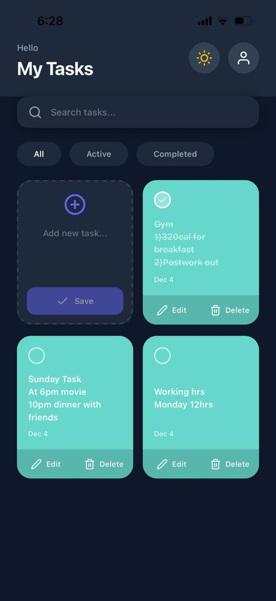
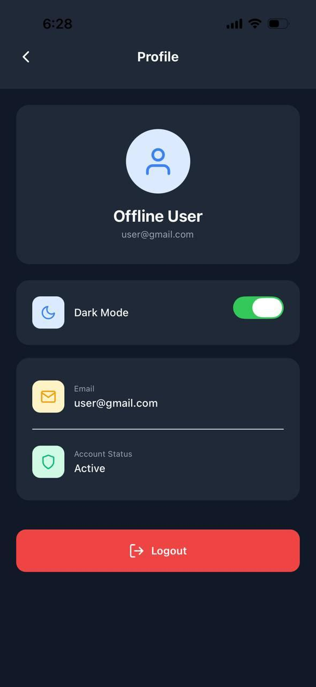

# 📝 Taskify App - Full Stack Mobile Application

A beautiful and feature-rich todo application built with React Native (Frontend) and Node.js/Express (Backend) with JWT authentication.
## ✨ Features

- 🔐 Login & Signup with JWT authentication
- 🌓 Dark mode toggle
- 🔍 Search & filter tasks (All/Active/Completed)
- ✏️ Create, edit, delete todos
- ✅ Mark tasks complete
- 💾 Offline support with AsyncStorage
- 📊 Task statistics (Total/Active/Done)
- 🎨 Clean UI with Feather icons

## 📸 Screenshots

### Light Mode


### Dark Mode


### Signup Task


### Login Screen


### Grid View


### Profile 



## 📂 Project Structure

```
MyApp/
├── App.js
├── src/
│   ├── api/axios.js
│   ├── navigation/AppNavigator.js
│   ├── screens/
│   │   ├── LoginScreen.js
│   │   ├── SignupScreen.js
│   │   ├── DashboardScreen.js
│   │   └── ProfileScreen.js
│   ├── components/TodoItem.js
│   └── context/AuthContext.js
│
backend/
├── controllers/
├── models/
├── routes/
├── middleware/authMiddleware.js
├── config/db.js
├── server.js
└── .env
```
### Prerequisites

- Node.js (v14 or higher)
- npm or yarn
- MongoDB (local or Atlas)
- Expo CLI (for React Native)
- Android Studio / Xcode (for emulators)

## 🚀 Quick Start

### Backend Setup

```bash
cd backend
npm install

# Create .env file
PORT=5000
MONGO_URI=mongodb://localhost:27017/taskify
JWT_SECRET=yourSecretKey

npm run dev
```

Backend runs at **http://localhost:5000**

### Frontend Setup

```bash
cd MyApp
npm install

# Install packages
npm install @react-navigation/native @react-navigation/stack
npm install axios @react-native-async-storage/async-storage
npm install react-native-vector-icons
npx expo install react-native-screens react-native-safe-area-context

# Start app
npm start
```

**Update API URL** in `src/api/axios.js`:
```javascript
baseURL: "http://10.0.2.2:5000",  // Android emulator
// baseURL: "http://localhost:5000",  // iOS simulator
// baseURL: "http://YOUR_IP:5000",    // Physical device
```

## 🛠️ Built With

**Frontend:**
- React Native
- Expo
- React Navigation
- Axios
- AsyncStorage
- Expo Vector Icons (Feather)

**Backend:**
- Node.js
- Express.js
- MongoDB
- Mongoose
- JWT (JSON Web Tokens)
- Bcrypt.js

## 🔐 API Endpoints

### Auth
- `POST /auth/signup` - Register user
- `POST /auth/login` - Login user
- `GET /profile` - Get user profile

### Todos
- `GET /todos` - Get all todos
- `POST /todos` - Create todo
- `PATCH /todos/:id` - Update todo
- `PATCH /todos/:id/complete` - Toggle complete
- `DELETE /todos/:id` - Delete todo

## 💾 Offline Support

App works without backend:
- ✅ Backend available → syncs with server
- ✅ Backend fails → uses AsyncStorage
- ✅ All features work offline

## 📦 Dependencies

**Backend:**
```
express, mongoose, jsonwebtoken, bcryptjs, cors, dotenv, nodemon
```

**Frontend:**
```
expo, react-navigation, axios, async-storage, react-native-vector-icons
```

## 🐛 Troubleshooting

**Network request failed?**
- Android Emulator → Use `10.0.2.2`
- iOS → Use `localhost`
- Physical device → Use your PC's IP

**Icons not showing?**
```bash
npx react-native link react-native-vector-icons
npx expo start --clear
```
## 📄 License

This project is licensed under the MIT License - see the LICENSE file for details.

## 👨‍💻 Author

Made by Kunal  
Built with ❤️ using React-Native(Expo) + Node.js
- LinkedIn: [Kunal Shinde](https://linkedin.com/in/kunalshinde11)
- Portfolio: [kunnaal11](https://kunnaal11.github.io/)
- Email: kdshinde2003@gmail.com

---

⭐ If you found this project helpful, please give it a star!